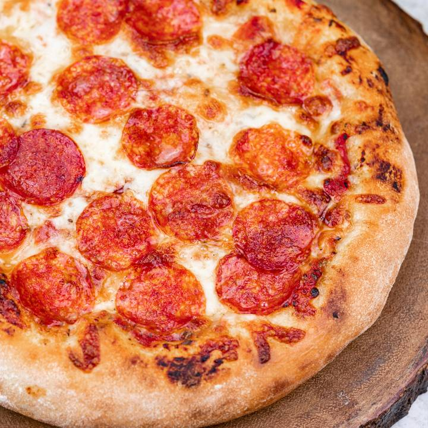
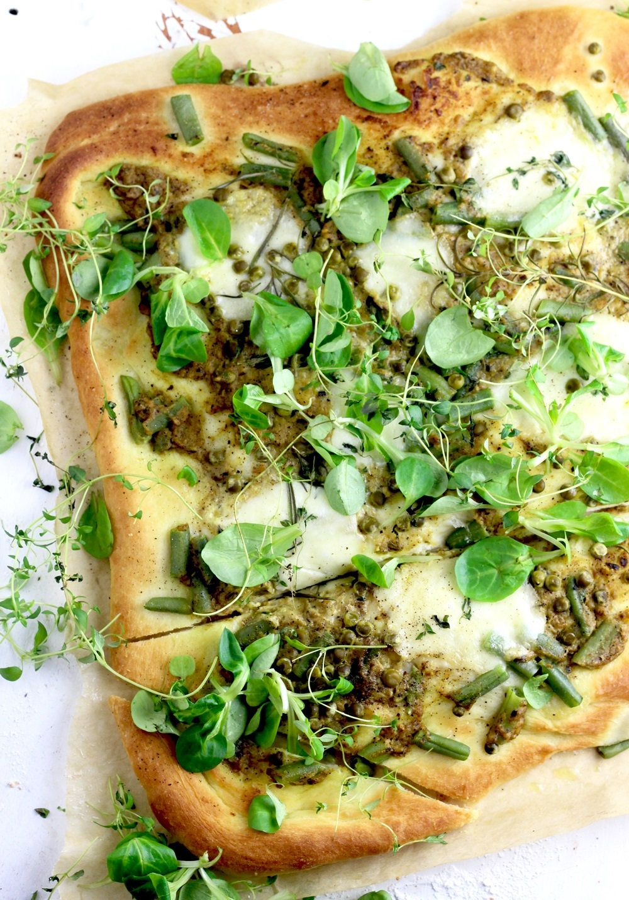
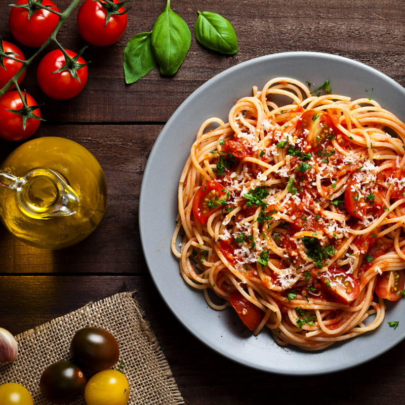

# Menu

## Pizza

|Lp.| Pizza                                                                                   | rozmiar | 30cm | 40cm | 50cm |
|---|-----------------------------------------------------------------------------------------|---------|------|------|------|
|1. |Pepperoni (sos pomidorowy, podwójna mozzarella, pepperoni)                               |         | 23zł | 33zł | 43zł |
|2. |Carbonara (sos kremowy, mozzarella, boczek,  pieczarki, cebula)                          |         | 24zł | 34zł | 44zł |
|3. |Diavola (sos pomidorowy, mozzarella, kiełbasa pepperoni, cebula, papryczki jalapeno)     |         | 25zł | 35zł | 45zł |
|4. |Contadina (sos pomidorowy, mozzarella, pieczony kurczak, cebula, kukurydza)              |         | 26zł | 36zł | 46zł |
|5. |BBQ (sos BBQ, mozzarella, boczek, pieczony kurczak, cebula, papryka)                     |         | 27zł | 37zł | 47zł |
|6. |Toscana (sos pomidorowy, mozzarella, szynka dojrzewająca, rukola, oregano, ser Corregio) |         | 29zł | 39zł | 49zł |

## Pizza wegerariańska 

|Lp.| Pizza                                                                                              | rozmiar | 30cm | 40cm | 50cm |
|---|----------------------------------------------------------------------------------------------------|---------|------|------|------|
|1. |Margherita (sos pomidorowy, podwójna mozzarella)                                                    |         | 22zł | 32zł | 42zł |
|2. |Vegetariana (sos pomidorowy, mozzarella, kukurydza, pomidorki koktajlowe, papryka, cebula, oregano) |         | 25zł | 35zł | 45zł |
|3. |Veggie (sos pomidorowy, mozzarella, szpinak, cebula, pieczarki, czarne oliwki, ser grecki)          |         | 25zł | 35zł | 45zł |
|4. |Quatro cheese (sos kremowy, sery: mozzarella, cheddar, ementaler, pleśniowy)                        |         | 28zł | 38zł | 48zł |

## Makarony

|Lp.| Makaron                                                                     | rozmiar | 350g | 500g |
|---|-----------------------------------------------------------------------------|---------|------|------|
|1. | Bolognese (spaghetti z sosem bolońskim)                                     |         | 22zł | 32zł |
|2. | Carbonara (spaghetti z podsmażanym boczkiem, cebulką i jajkiem)             |         | 25zł | 35zł |
|3. | Spaghetti al Frutti di Mare (spaghetti z owocami morza w sosie pomidorowym) |         | 28zł | 38zł |
